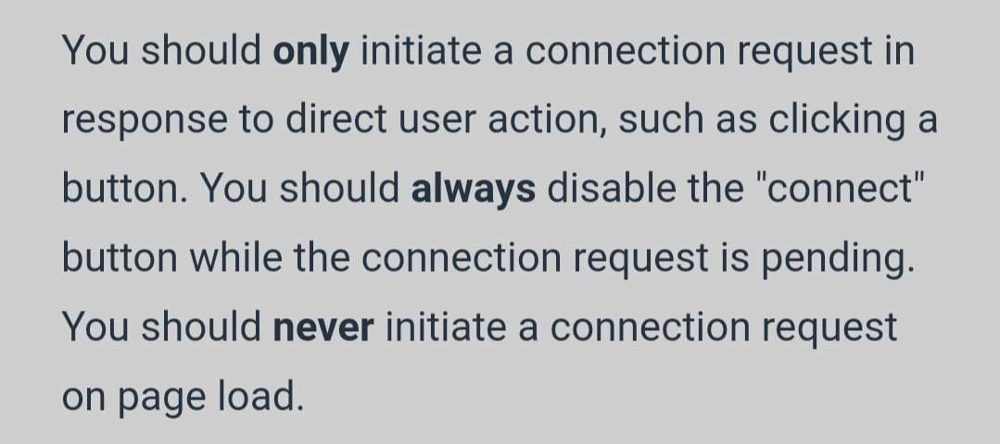

Some recommendations from the Metamask API documentation:

`etherem.on('connect', handler)` and `ethereum.on('disconnect', handler)`
are event listeners that are going to track the provider connection to the blockchain 
(this does NOT track the wallet's connection):

